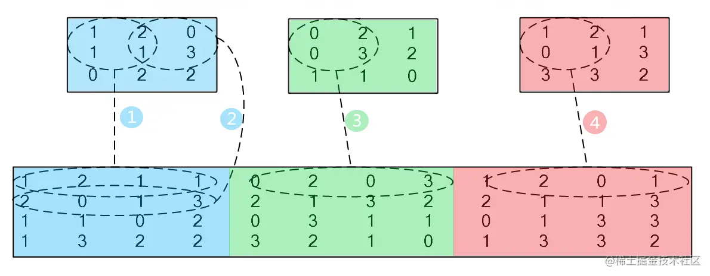

# <center>convolution cuda

使用cuda编程，针对Tesla K80芯片进行的卷积函数库封装，使用直接卷积和Im2col方法


<font color=blue>实现过程中，由于global memory的访存速度比较慢，使用每个block的shared memory以加速访存，具体的优化操作是在每个__global__核函数中使用__shared__在shared memory开辟内存

k80显卡每个SM的shared memory大小为48KB（49152 字节），因此在开辟空间时需要注意不要超过这个范围。</font>


## 算法原理
 
### 1、直接卷积
在信号处理、图像处理和其他工程/科学领域，卷积是一种使用广泛的技术。在深度学习领域，卷积神经网络(CNN)这种模型架构就得名于这种技术。在本实验中，我们将在GPU上实现卷积操作，注意这里的卷积是指神经网络中的卷积操作，与信号处理领域中的卷积操作不同，它不需要对Filter进行翻转，不考虑bias。


通过CUDA实现直接卷积（滑窗法），输入从256增加至4096或者输入从32增加至512.
输入：Input和Kernel(3*3)
问题描述：用直接卷积的方式对Input进行卷积，这里只需要实现2D, height*width，
通道channel(depth)设置为3，Kernel (Filter)大小设置为3*3，步幅(stride)分别设置为1，2，3，可能需要通过填充(padding)配合步幅(stride)完成CNN操作。
注：实验的卷积操作不需要考虑bias(b)，bias设置为0.
输出：输出卷积结果以及计算时间

**实现过程**
<font color=blue>采用shared memory方案时，考虑步长stride为2的情形，这时output矩阵的大小约为input矩阵的一半，需要按照输入矩阵input而不是输出output进行块划分（每个线程对应input矩阵的一个元素）。因为在核函数convolution2D中，我们需要把每个块对应的输入矩阵input移动到对应的共享内存shared memory中，当output的索引增加1时，input的索引增加2，如果按照output矩阵进行块划分，将无法做到将每个input的元素都移动到shared memory中。</font>

在我尝试对output矩阵进行块划分时（每个线程对应output矩阵的一个元素），考虑过针对步长stride进行for循环，在每个线程处理output矩阵的一个元素时候，将周围的input元素加入shared memory，但是由于步长的改变，会超出共享内存的大小，因此该方案被否定。

查阅资料可知Nvidia K80显卡，每个线程块的共享内存大小：48 KB（即 49152 字节）。
shared input的声明如下
```c
#define BLOCK_SIZE 32
__shared__ double shared_input[BLOCK_SIZE + 2][BLOCK_SIZE + 2][3];
```
$$34 \times 34 \times 3 \times 8字节=27792字节 < 49152 字节$$
可以满足需求。

具体操作过程如下图所示


### 2、im2col

使用im2col方法结合gemm cuda实现的GEMM（通用矩阵乘法）实现卷积操作。输入从256增加至4096或者输入从32增加至512，具体实现的过程可以参考下面的图片和参考资料。
输入：Input和Kernel (Filter)
问题描述：用im2col的方式对Input进行卷积，这里只需要实现2D, height\*width，通道channel(depth)设置为3，Kernel (Filter)大小设置为3\*3。 注：实验的卷积操作不需要考虑bias(b)，bias设置为0，步幅(stride)分别设置为1，2，3。
输出：卷积结果和时间。


**实现过程**

为了方便调用，首先修改gemm_shared.cu文件，将矩阵乘法封装成函数
```c
void perform_matrix_multiply(double* A, double* B, double* C, int M, int N, int K);
```

为了调用矩阵乘法，将input image和卷积核kernel展开。其中image展开的过程如图所示，三个颜色代表三个输入的channel；同时将kernel展开成列向量（纵向堆叠三次—），这样第一行乘第一列便得到了第一轮卷积的结果，存入目标矩阵中。


在代码的具体实现中，首先将输入矩阵转换成patched_matrix，然后调用自己实现的GEMM通用矩阵乘法库即可。

其中，难点在于如何将输入矩阵转换成patched_matrix，我选择按照patched matrix的大小划分网格，根据上图简单计算可得patched matrix的维度是(output size \* output size, 3 \* kernel_size \* kernel_size)，由于3 \* kernel_size \* kernel_size比较小，因此将矩阵的全部列划分到一个SM中，仅针对patched matrix的行进行块划分。
这里需要小心的处理好坐标之间的映射关系，对此，我绘制如下图像便于推导坐标。（结合任务三的线程分配图一起推导即可）


## 效果展示

### 直接卷积

代码使用shared memory

|规模\stride|1|2|3|
|:---:|:---:|:---:|:---:|
|256|2.38|2.01|1.91|
|512|6.75|5.04|4.73|
|1024|23|21|15|
|2048|99|66|61|
|4096|351|258|238|


### im2col

|规模\stride|1|2|3|
|:---:|:---:|:---:|:---:|
|256|6.02|2.56|2.41|
|512|15.32|7.26|6.89|
|1024|70|26|19|
|2048|217|110|86|
|4096|687|335|291|


总的来说，使用自己的矩阵计算库进行计算与直接进行卷积，时间差距不大，在可接受的范围内。
个人认为相差的时间主要来自于将矩阵转换成patched matrix的时间
